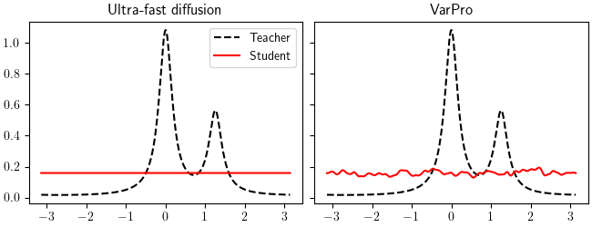

This repo provides the code to reproduce the numerical result presented in the paper:
["Ultra-fast feature learning for the training of two-layer neural networks in the two-timescale regime"](https://arxiv.org/abs/2504.18208)

# SHL in 1d with ReLU activation (Section 6.1)
Experiments with SHL neural networks with features on $\mathbb{S}^1$.
Experiments where performed using 32000 training epochs. The parameter `--epochs` can be changed to reduce training time.
You might also want to change the `--seed`parameter to change the random seed.
Once all experiments have been run you can reproduce the figures with the notebook `Results_SHL.ipynb`.
Additionally an animated gif can be created with the notebook `1d_animations.ipynb`




### Numerical resolution of ultra-fast diffusion
To compare VarPro with the ultra-fast diffusion, it is first required to compute the solutions to ultra-fast diffusion with the corresponding values of $\gamma$, controlling the shape of the teacher distribution.

```
python make_diffusion.py --epochs 32000 --gamma 10
python make_diffusion.py --epochs 32000 --gamma 100
python make_diffusion.py --epochs 32000 --gamma 1000
```

### Training SHL with VarPro and biased regularization $f(t) = t^2/2$
This code is located in the directory `VarPro_ReLU_1d`.
Results will be stored in `VarPro_ReLU_1d/results`.
In the paper we consider:

* Varying the width $M$:
 
```
python Experiment.py --seed 0 --epochs 32000 --lambda 1e-3 --student_width 32
python Experiment.py --seed 0 --epochs 32000 --lambda 1e-3 --student_width 128
python Experiment.py --seed 0 --epochs 32000 --lambda 1e-3 --student_width 512
python Experiment.py --seed 0 --epochs 32000 --lambda 1e-3 --student_width 1024
```

* Varying the regularization strength $\lambda$:

```
python Experiment.py --seed 0 --epochs 32000 --lambda 1e-1 --student_width 1024
python Experiment.py --seed 0 --epochs 32000 --lambda 1e-2 --student_width 1024
python Experiment.py --seed 0 --epochs 32000 --lambda 1e-3 --student_width 1024
python Experiment.py --seed 0 --epochs 32000 --lambda 1e-4 --student_width 1024
```

### Training SHL with VarPro and unbiased regularization $f(t) = (t-1)^2/2$
This code is located in the directory `VarPro_ReLU_1d_unbiased`.
Results will be stored in `VarPro_ReLU_1d_unbiased/results`.
In the paper we consider:

* Varying the width $M$:
 
```
python Experiment.py --seed 0 --epochs 32000 --lambda 1e-3 --student_width 32
python Experiment.py --seed 0 --epochs 32000 --lambda 1e-3 --student_width 128
python Experiment.py --seed 0 --epochs 32000 --lambda 1e-3 --student_width 512
python Experiment.py --seed 0 --epochs 32000 --lambda 1e-3 --student_width 1024
```

* Varying the regularization strength $\lambda$:

```
python Experiment.py --seed 0 --epochs 32000 --lambda 1e-1 --student_width 1024
python Experiment.py --seed 0 --epochs 32000 --lambda 1e-2 --student_width 1024
python Experiment.py --seed 0 --epochs 32000 --lambda 1e-3 --student_width 1024
python Experiment.py --seed 0 --epochs 32000 --lambda 1e-4 --student_width 1024
```

* Varying the shape parameter $\gamma$ of the teacher distribution:

```
python Experiment.py --seed 0 --epochs 32000 --lambda 1e-1 --student_width 1024 --gamma 10
python Experiment.py --seed 0 --epochs 32000 --lambda 1e-2 --student_width 1024 --gamma 100
python Experiment.py --seed 0 --epochs 32000 --lambda 1e-3 --student_width 1024 --gamma 1000
```

### Training SHL with 2-timescale GD and unbiased regularization $f(t) = (t-1)^2/2$
This code is located in the directory `2TS_ReLU_1d_unbiased`.
Results will be stored in `2TS_ReLU_1d_unbiased/results`.
In the paper we consider:

* Varying the width $M$:
 
```
python Experiment.py --seed 0 --epochs 32000 --lambda 1e-3 --student_width 32
python Experiment.py --seed 0 --epochs 32000 --lambda 1e-3 --student_width 128
python Experiment.py --seed 0 --epochs 32000 --lambda 1e-3 --student_width 512
python Experiment.py --seed 0 --epochs 32000 --lambda 1e-3 --student_width 1024
```

* Varying the regularization strength $\lambda$:

```
python Experiment.py --seed 0 --epochs 32000 --lambda 1e-1 --student_width 1024
python Experiment.py --seed 0 --epochs 32000 --lambda 1e-2 --student_width 1024
python Experiment.py --seed 0 --epochs 32000 --lambda 1e-3 --student_width 1024
```

# ResNets for classification on CIFAR10 (Section 6.2)

Once experiments are perfomed, the figures in Section 6.2 can be reproduced with the notebook `Results_resnets.ipynb`.
The code for the experiments is located in the directory `VarPro_resnet`.
Results will be stored in `VarPro_resnet/results`.
In the paper we consider:

* Training a ResNet with a stochastic variant of VarPro:
```
python CIFAR10_VarProM.py --lmbda 1e-3 --batch_size 64 --time_scale 1e-3 --momentum 0.9 --epochs 100
```
for `--batch_size` in `{64, 128, 256, 512, 1024}`.
* Training a ResNet with SGD with momentum:
```
python CIFAR10_SGDM.py --lmbda 1e-3 --batch_size 64 --time_scale 1e-3 --momentum 0.9 --epochs 100
```
for `--batch_size` in `{64, 128, 256, 512, 1024}`.
* Training a ResNet with Shampoo:
```
python CIFAR10_Shampoo.py --lmbda 1e-3 --batch_size 64 --time_scale 1e-2 --momentum 0.9 --epochs 100
```
for `--batch_size` in `{64, 128, 256, 512, 1024}`.

# RBF neural network in 2d with cos activation (Appendix B)
Experiments with RBF neural networks with features on $\Omega = \mathbb{R}^2/ 4 \mathbb{Z}^2$.
Experiments where performed using 32000 training epochs. The parameter `--epochs` can be changed to reduce training time.
You might also want to change the `--seed`parameter to change the random seed.
Once all experiments have been run you can reproduce the figures with the notebook `Results_convolution.ipynb`.

### Training RBF-NN with VarPro and biased regularization $f(t) = t^2/2$
This code is located in the directory `VarPro_convolution_2d`.
Results will be stored in `VarPro_convolution_2d/results`.
In the paper we consider:

* Varying the width $M$:

```
python Experiment.py --seed 0 --epochs 32000 --lambda 1e-3 --student_width 32
python Experiment.py --seed 0 --epochs 32000 --lambda 1e-3 --student_width 128
python Experiment.py --seed 0 --epochs 32000 --lambda 1e-3 --student_width 512
python Experiment.py --seed 0 --epochs 32000 --lambda 1e-3 --student_width 1024
```

* Varying the regularization strength $\lambda$:

```
python Experiment.py --seed 0 --epochs 32000 --lambda 1e-1 --student_width 1024
python Experiment.py --seed 0 --epochs 32000 --lambda 1e-2 --student_width 1024
python Experiment.py --seed 0 --epochs 32000 --lambda 1e-3 --student_width 1024
```

### Training SHL with VarPro and unbiased regularization $f(t) = (t-1)^2/2$
This code is located in the directory `VarPro_convolution_2d_unbiased`.
Results will be stored in `VarPro_convolution_2d_unbiased/results`.
In the paper we consider:

* Varying the width $M$:
 
```
python Experiment.py --seed 0 --epochs 32000 --lambda 1e-3 --student_width 32
python Experiment.py --seed 0 --epochs 32000 --lambda 1e-3 --student_width 128
python Experiment.py --seed 0 --epochs 32000 --lambda 1e-3 --student_width 512
python Experiment.py --seed 0 --epochs 32000 --lambda 1e-3 --student_width 1024
```

* Varying the regularization strength $\lambda$:

```
python Experiment.py --seed 0 --epochs 32000 --lambda 1e-1 --student_width 1024
python Experiment.py --seed 0 --epochs 32000 --lambda 1e-2 --student_width 1024
python Experiment.py --seed 0 --epochs 32000 --lambda 1e-3 --student_width 1024
```


