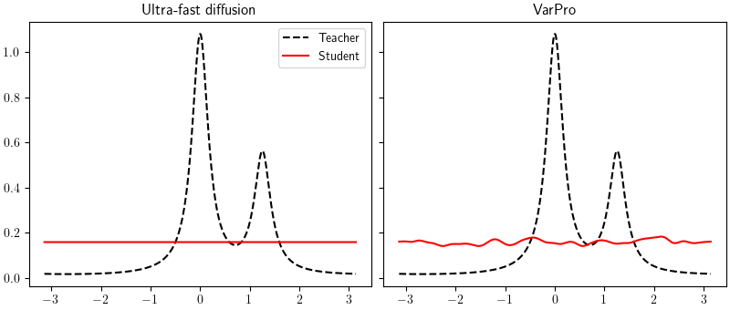

This repo provides the code to reproduce the numerical result presented in the paper:
["Ultra-fast feature learning for the training of two-layer neural networks in the two-timescale regime"](https://arxiv.org/abs/2504.18208)



# RBF neural network in 2d with cos activation (Appendix B)
Experiments with RBF neural networks with features on $\Omega = \mathbb{R}^2/ 4 \mathbb{Z}^2$.

Experiments where performed using 32000 training epochs. The parameter `--epochs` can be changed to reduce training time.

You might also want to change the `--seed`parameter to change the random seed.

Once all experiments have been run you can reproduce the figures with the notebook `Results_convolution.ipynb`.

### Training RBF-NN with VarPro and biased regularization $f(t) = t^2/2$
This code is located in the directory `VarPro_convolution_2d`.

Results will be stored in `VarPro_convolution_2d/results`.

In the paper we consider:

* Varying the width $M$:

```
python Experiment.py --seed 0 --epochs 32000 --lambda 1e-3 --student_width 32
python Experiment.py --seed 0 --epochs 32000 --lambda 1e-3 --student_width 128
python Experiment.py --seed 0 --epochs 32000 --lambda 1e-3 --student_width 512
python Experiment.py --seed 0 --epochs 32000 --lambda 1e-3 --student_width 1024
```

* Varying the regularization strength $\lambda$:

```
python Experiment.py --seed 0 --epochs 32000 --lambda 1e-1 --student_width 1024
python Experiment.py --seed 0 --epochs 32000 --lambda 1e-2 --student_width 1024
python Experiment.py --seed 0 --epochs 32000 --lambda 1e-3 --student_width 1024
```

### Training SHL with VarPro and unbiased regularization $f(t) = (t-1)^2/2$
This code is located in the directory `VarPro_convolution_2d_unbiased`.

Results will be stored in `VarPro_convolution_2d_unbiased/results`.

In the paper we consider:

* Varying the width $M$:
 
```
python Experiment.py --seed 0 --epochs 32000 --lambda 1e-3 --student_width 32
python Experiment.py --seed 0 --epochs 32000 --lambda 1e-3 --student_width 128
python Experiment.py --seed 0 --epochs 32000 --lambda 1e-3 --student_width 512
python Experiment.py --seed 0 --epochs 32000 --lambda 1e-3 --student_width 1024
```

* Varying the regularization strength $\lambda$:

```
python Experiment.py --seed 0 --epochs 32000 --lambda 1e-1 --student_width 1024
python Experiment.py --seed 0 --epochs 32000 --lambda 1e-2 --student_width 1024
python Experiment.py --seed 0 --epochs 32000 --lambda 1e-3 --student_width 1024
```


