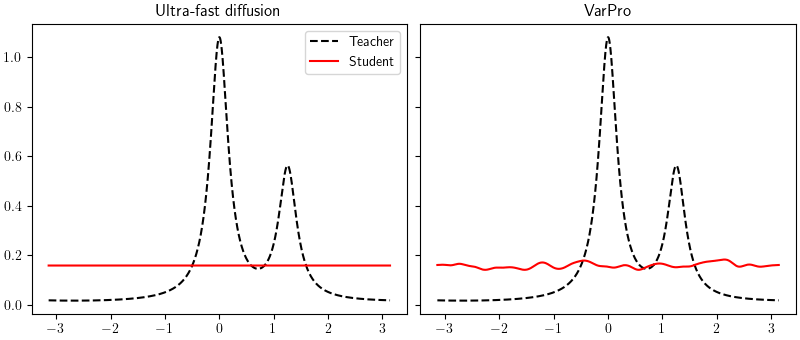

# SHL in 1d with ReLU activation (Section 6.1)
Experiments with SHL neural networks with features on $\mathbb{S}^1$.

The code for reproducing the experiments is in the file `Experiment.py`. Results will be stored as ziped `.pkl`files in `results/`.

Experiments where performed using 32000 training epochs. The parameter `--epochs` can be changed to reduce training time. You might also want to change the `--seed`parameter to change the random seed. Add a supplementary `-p`if you want a `tqdm`progressbar.

Once all experiments have been run you can reproduce the figures with the notebook `Results_SHL.ipynb`.

Additionally an animated gif can be created with the notebook `1d_animations.ipynb`




### Numerical resolution of ultra-fast diffusion
To compare VarPro with the ultra-fast diffusion, it is first required to compute the solutions to ultra-fast diffusion with the corresponding values of $\gamma$, controlling the shape of the teacher distribution.

```
python make_diffusion.py --epochs 32000 --gamma 10
```
for `--gamma`in `{10, 100, 1000}`.

### Training SHL with VarPro$

We first consider training the SHL model with a Variable Projection algorithm.

The parameter `--regularization` allows to chose between biased regularization $f(t) = t^2$ and unbiased regularization $f(t) = (t-1)^2$.

In the paper we consider:

* Varying the width $M$:
 
```
python Experiment.py --regularization 'biased' --seed 0 --epochs 32000 --lambda 1e-3 --student_width 32
python Experiment.py --regularization 'unbiased' --seed 0 --epochs 32000 --lambda 1e-3 --student_width 32
```
for `--student_width`in `{32, 128, 512, 1024}`.

* Varying the regularization strength $\lambda$:

```
python Experiment.py --regularization 'biased' --seed 0 --epochs 32000 --lambda 1e-1 --student_width 1024
python Experiment.py --regularization 'unbiased' --seed 0 --epochs 32000 --lambda 1e-1 --student_width 1024
```
for `--lambda`in `{1e-1, 1e-2, 1e-3, 1e-4}`.


* Varying the shape parameter $\gamma$ of the teacher distribution:

```
python Experiment.py --seed 0 --regularization 'unbiased' --epochs 32000 --lambda 1e-3 --student_width 1024 --gamma 10
```
for `--gamma`in `{10, 100, 1000}`.

### Training SHL with 2-timescale GD and unbiased regularization $f(t) = (t-1)^2/2$

We also consider training the SHL model with a two-timescale gradient descent algorithm.

In the paper we consider:

* Varying the width $M$:
 
```
python Experiment.py --TwoTS --seed 0 --epochs 32000 --lambda 1e-3 --student_width 32
```
for `--student_width`in `{32, 128, 512, 1024}`.

* Varying the regularization strength $\lambda$:

```
python Experiment.py --TwoTS --seed 0 --epochs 32000 --lambda 1e-1 --student_width 1024
```
for `--lambda`in `{1e-1, 1e-2, 1e-3, 1e-4}`.