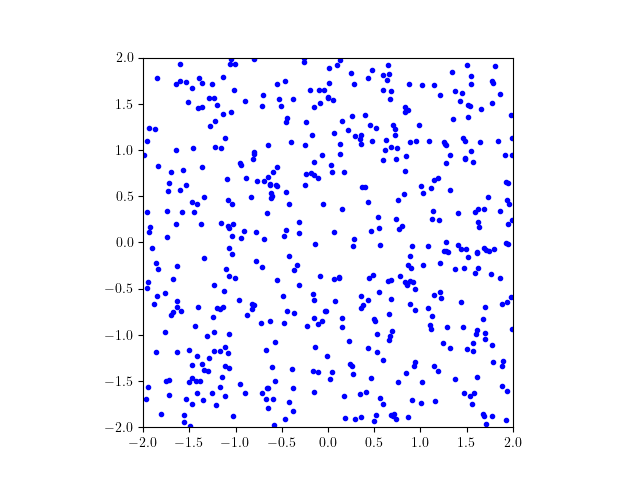
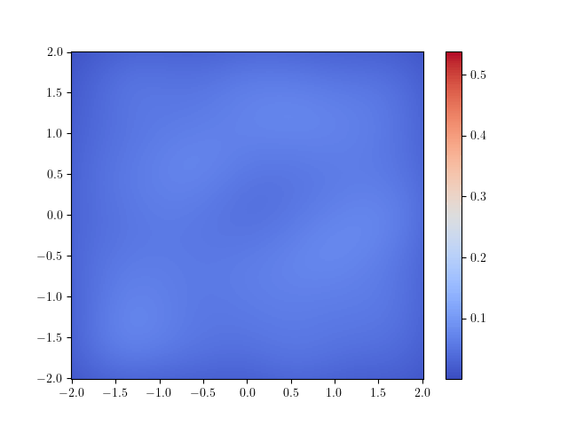

# RBF neural network in 2d with cos activation (Appendix B)
Experiments with RBF neural networks with features on $\Omega = \mathbb{R}^2/ 4 \mathbb{Z}^2$.

Experiments where performed using 32000 training epochs. The parameter `--epochs` can be changed to reduce training time. You might also want to change the `--seed`parameter to change the random seed.

Once all experiments have been run you can reproduce the figures with the notebook `Results_convolution.ipynb`.

Additionally an animated gif can be created with the notebook `2d_animations.ipynb`




### Training RBF-NN with VarPro

The code for reproducing experiment is in the file `Experiment.py`.

Results will be stored in `results`.

In the paper we consider:

* Varying the width $M$:

```
python Experiment.py --seed 0 --regularization 'biased' --epochs 32000 --lambda 1e-3 --student_width 32
python Experiment.py --seed 0 --regularization 'unbiased' --epochs 32000 --lambda 1e-3 --student_width 32
```

for `--student_width`in `{32, 128, 512, 1024}`.

* Varying the regularization strength $\lambda$:

```
python Experiment.py --regularization 'biased' --seed 0 --epochs 32000 --lambda 1e-1 --student_width 1024
python Experiment.py --regularization 'unbiased' --seed 0 --epochs 32000 --lambda 1e-1 --student_width 1024
```
for `--lambda`in `{1e-1, 1e-2, 1e-3}`.

* Varying the shape parameter $\gamma$ of the teacher distribution:

```
python Experiment.py --seed 0 --regularization 'unbiased' --epochs 32000 --lambda 1e-2 --student_width 1024 --gamma 100
```
for `--gamma`in `{100, -1}`.